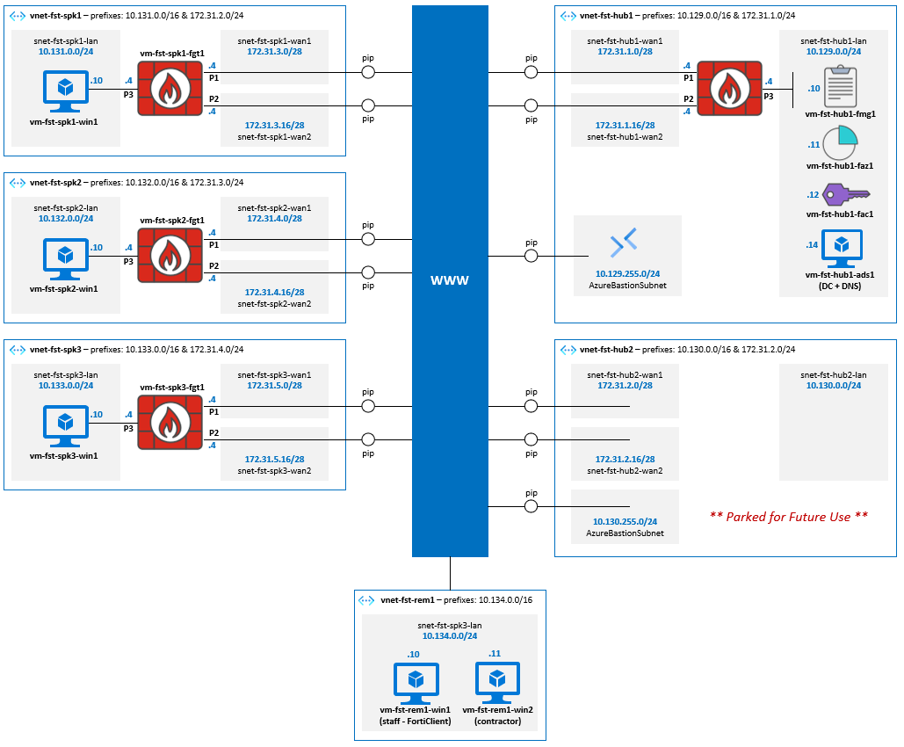

# Secure Transport Lab – Azure Deployment

This repository contains a modular Azure lab that emulates a Fortinet SD-WAN environment across hub, spoke, and remote sites, with supporting services and workloads.

Azure is used to replicate SD-WAN underlay. All connectivity is via overlay (no VNet peering).

# Diagram

Diagram shows components deployed and intended use-cases:



## Deployment

Run from Azure Cloud Shell (Bash):

```bash
# remove existing repo (if present)
rm -rf secure-transport-lab

# clone latest repo
git clone https://github.com/jtanderson2/secure-transport-lab.git

# change to Azure deployment directory
cd secure-transport-lab/azure

# make scripts executable
chmod +x *.sh */*.sh

# deploy full lab
./deploy-all.sh
```

This deploys in order:

- Hub networks
- Spoke networks
- Remote networks
- FortiGate VMs
- Windows VMs
- Management (FortiManager, FortiAnalyzer, FortiAuthenticator)

### Notes
- All deployments are Azure CLI-driven using JSON configuration files.
- No Fortinet licensing is applied. BYOL is assumed.
- No OS configuration is applied. This is 'bare bones' deployment ready for management and overlay to be built.
- Hub2 is parked for future use. Azure networking components are deployed, but no compute.
- Remote site is for remote user testing.
- NICs (and respective PIPs) for FortiGates are configured in hub and spoke scripts. NICs for other compute configured in respective VM scripts.

## Modular Deployment

Components can be deployed individually from their respective folders:

- `hubs`, `spokes`, `remotes`
- `fortigates`
- `fortimanager`, `fortianalyzer`, `fortiauthenticator`
- `windows`

See each folder for component-specific instructions.

## Initial Access

- FortiGates: accessible via public IP
- Windows VMs: access via Azure Bastion (Developer SKU)
- Management (FMG/FAZ/FAC): access on private IPs via Hub1 Bastion and Windows VM
- Additional access options available once FortiGates and SD-WAN overlay are configured

VM Credentials

- Username: `fstadmin`
- Password: `F@rT15eCuR3!` *(change after first login)*

## Destroy

Run from Azure Cloud Shell (Bash):

```bash
# assumes repo is cloned into azcli session, see above

# change to Azure deployment directory
cd secure-transport-lab/azure

# destroy full lab
./destroy-all.sh
```
